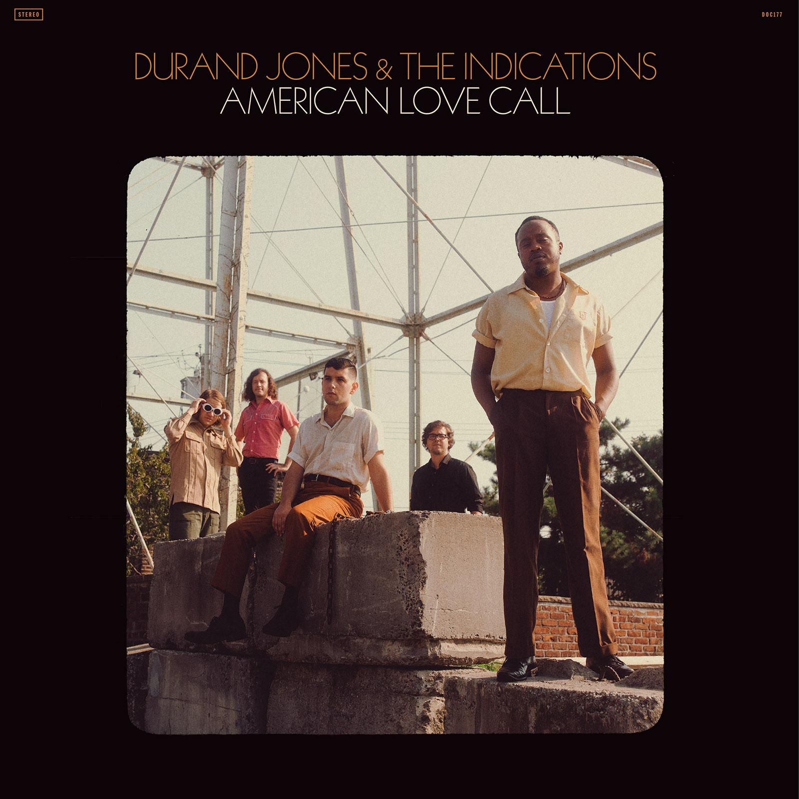
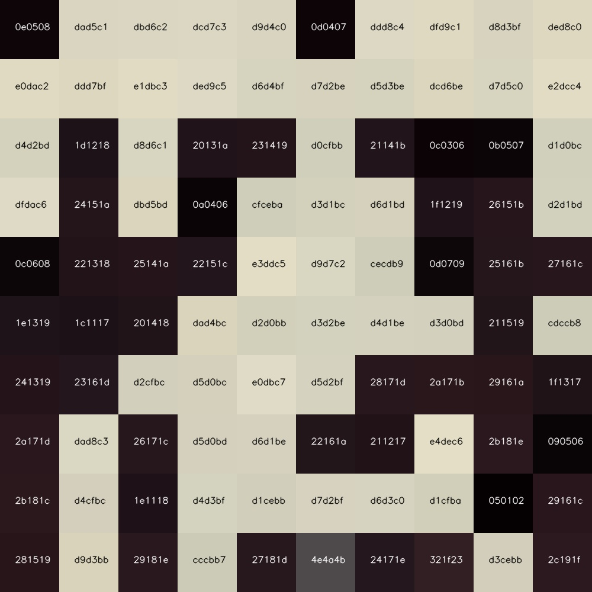

# color-frequency
C++ project for finding the most frequent colors in a given image, generating a palette of the 200 most frequent colors, and generating a csv file containing all colors found in the image and their frequency.

## Prerequisites:
- g++ (C++ compiler)
- Make
- OpenCV

## To run:
1. Clone the repository
2. Navigate to the directory containing the Makefile (root directory)
3. Run `make` to compile the program and generate the executable
4. Run `./color-frequency <image_file>` from the root directory to run the program on the image of your choice (include file extension but exclude file path)

Included in the `res/in` directory are some sample images of album covers I used to test the program. The program is hardcoded to look inside the `res/in` directory for the image file, so if you want to use your own image, you'll need to move it into that directory.

## Output:
The program will generate two files in the `res/out` directory:
1. `<image_file_name>.jpg` - a 1000x1000 image containing the 100 most frequent colors in the original image
2. `<image_file_name>.csv` - a csv file containing every colors' RGB values, hex code, and frequency in the original image (sorted by frequency in descending order)

## Examples:
<table>
  <tr>
    <td></td>
    <td>Input Image</td>
    <td>Output Image</td>
  </tr>
  <tr>
    <td><i>Lahai</i> - Sampha</td>
    <td></td>
    <td></td>
  </tr>
  <tr>
    <td><i>American Love Call</i> - Durand Jones &amp; The Indications</td>
    <td></td>
    <td></td>
  </tr>
  <tr>
    <td><i>Wish You Were Here</i> - Pink Floyd</td>
    <td></td>
    <td></td>
  </tr>
  <tr>
    <td><i>NEVER ENOUGH</i> - Daniel Caesar</td>
    <td></td>
    <td></td>
  </tr>
  <tr>
    <td><i>This Old Dog</i> - Mac DeMarco</td>
    <td></td>
    <td></td>
  </tr>
</table>
